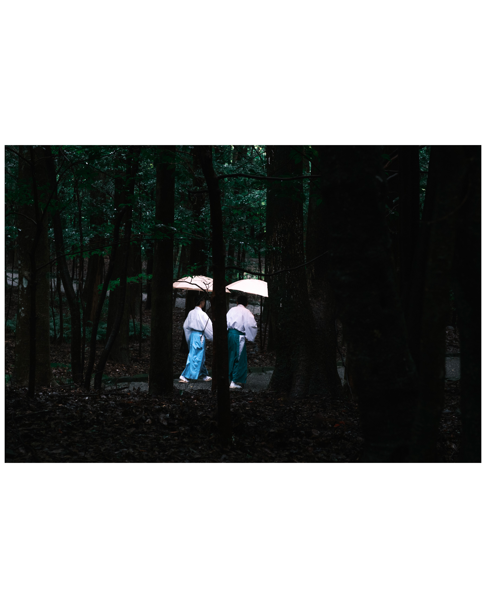

# Framed

## Why
I had a problem: when posting multiple photo taken with my camera(s) on social media and using borders to keep a constant aspect ratio, certain pictures had more borders than content.

This is fine.


This is not.


What if I could make better use of all that empty space?

For example:


This is why I created **framed**: a simple, free application that allows me (and you) to put two (not three, nor more) pictures together.

## Features

- Select frame orientation (portrait or landscape)
- Multiple aspect ratios (3:2, 4:3, 5:4, 16:9)
- Custom frame color selection
- Configurable border size
- Drag-and-drop image upload
- High-resolution image export
- PWA support - installable on mobile and desktop devices

## Tech Stack

- **Framework**: VueJS
- **Canvas**: Konva.js with vue-konva
- **Styling**: Tailwind CSS
- **Build Tool**: Vite
- **Testing**: Vitest with @vue/test-utils
- **Linting**: ESLint

## Getting Started

### Setup

```bash
# Setup environment
mise install
# Install dependencies
npm ci
```

### Development

```bash
# Start development server
npm run dev

# Run tests
npm test

# Run tests with coverage
npm run test:coverage

# Run tests in UI mode
npm run test:ui
```

### Build

```bash
# Create production build
npm run build

# Preview production build
npm run preview
```

### Code Quality

```bash
# Run linter
npm run lint

# Fix linting issues
npm run lint:fix

# Format code
npm run format
```

## CI/CD

This project uses GitHub Actions for continuous integration and deployment:

### Automated Workflows

- **CI**: Runs linter, tests, and build on all non-main branches and pull requests
- **Build and Deploy**: Automatically builds and deploys to GitHub Pages on every tag

## AI Disclaimer
AI tools have been used to contribute to this project.
